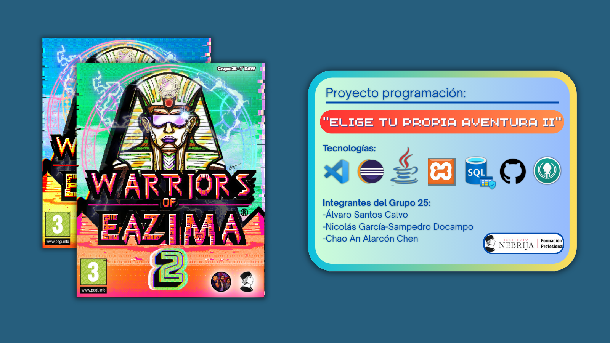
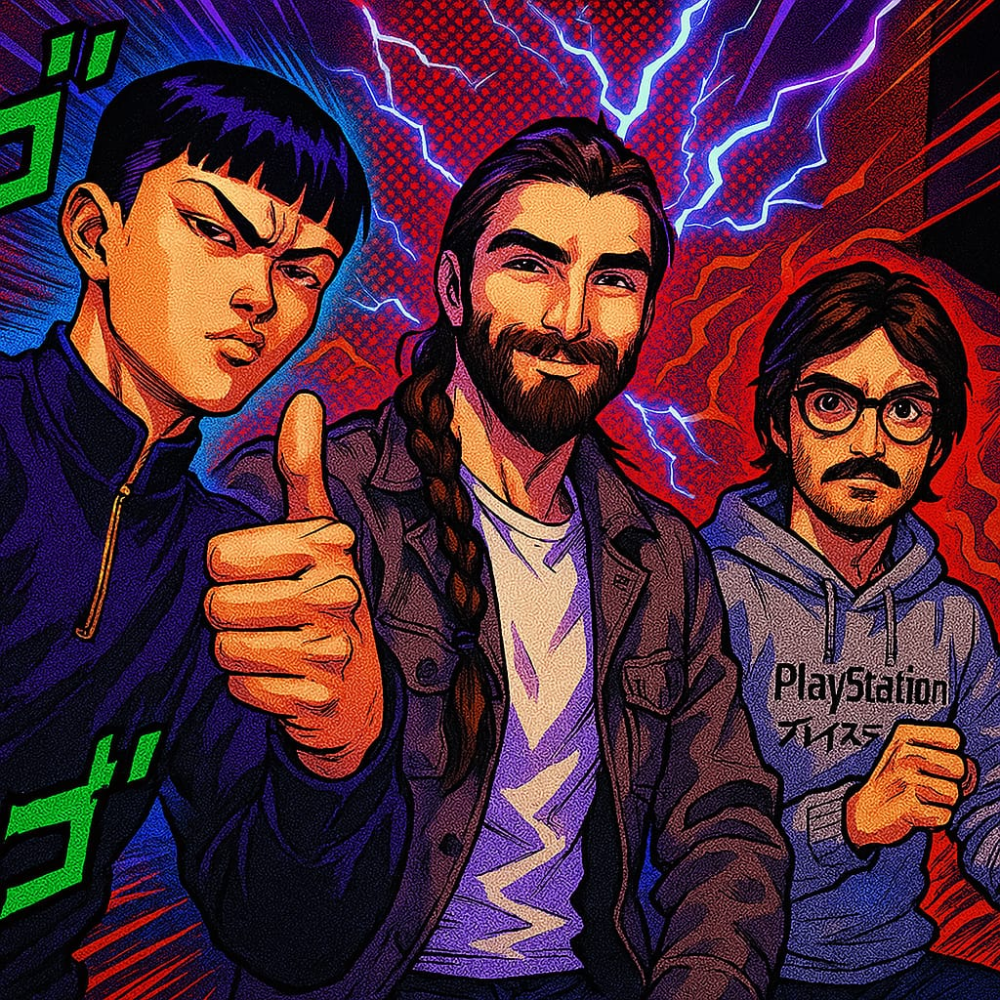

# Elige tu propia aventura II 🎮

## Objetivo 📌
Mejorar el juego existente *"Elige tu propia aventura"* o desarrollar una nueva versión, aplicando programación orientada a objetos y conexión a bases de datos.

## Detalles del Proyecto 🗂
- **Nombre del proyecto:** Elige tu propia aventura II  
- **Institución:** Instituto Nebrija Formación Profesional 
- **Estado:** En desarrollo  

## Integrantes del Grupo 👥️
- Álvaro Santos Calvo
- Nicolás García-Sampedro Docampo
- Chao An Alarcón Chen

## Tecnologías 🛠
- **Lenguaje:** Java  
- **Base de datos:** MySQL 
- **Herramientas:** Visual Studio Code - Eclipse

## Notas 📝
- NO TOCAR EL ARCHIVO "classpath"
- ONTO: Reemplazas todo lo que tiene el main con lo tuyo(Lo tuyo tiene que estar bien) || Es cuando está en la misma línea en GitKraken
- INTO: Se fusionan ambas Ramas || Es cuando está en una línea diferente en GitKraken

